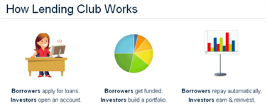

# Lending-Club-Case-Study

# Problem statement

Lending Club is a consumer finance company which specializes in lending various types of loans to urban customers, matching borrowers with investors using an online marketplace. 

## What is its loan approval process?
When the company receives a loan application, company must decide for loan approval:
Loan approval is based on the applicant's profile, with the goal of minimizing credit loss
Credit loss is the amount of money lost by the lender when the borrower refuses to pay or runs away with the money owed
'Charged-off' customers are the defaulters who cause the largest amount of loss to the lenders

Like most other lending companies, *lending loans to ‘risky’* applicants is the largest source of financial loss *(called credit loss)*. The credit loss is the amount of money lost by the lender when the borrower refuses to pay or runs away with the money owed.

In other words, **borrowers** who **default** cause the largest amount of **loss to the lenders**. In this case, the customers labelled as *'charged-off' are the 'defaulters'*.

The core objective of the excercise is to **help the company minimise the credit loss**. There are two potential sources of **credit loss** are:
* Applicant **likely to repay the loan**, such an applicant will bring in profit to the company with interest rates.** Rejecting such applicants will result in loss of business**.
* Applicant **not likely to repay** the loan, i.e. and will potentially default, then approving the loan may lead to a financial loss* for the company

# What is the business objective?
•The primary objective is aimed at minimizing credit loss to the company. Like most other lending companies, lending loans to ‘risky’ applicants is the largest source of financial loss (called credit loss).

•The goal is to identify these risky loan applicants, If one is able to identify these risky loan applicants, then such loans can be reduced thereby cutting down the amount of credit loss.

# What is the case-study exercise objective?

•The company wants to understand the driving factors (or driver variables) behind loan default, i.e., the variables which are strong indicators of default. The company can utilize this knowledge for its portfolio and risk assessment.

•Identification of such factors for risky applicants using EDA of the given dataset, is the aim of this case study.

# Case Study Approach
The Case Study Approach involves breaking down the analysis into four key components:  
    Data understanding  
    Data cleaning (cleaning missing values, removing redundant columns etc.) 
    Data Analysis  
    Recommendations

#Author
Godwin Paul Vincent
